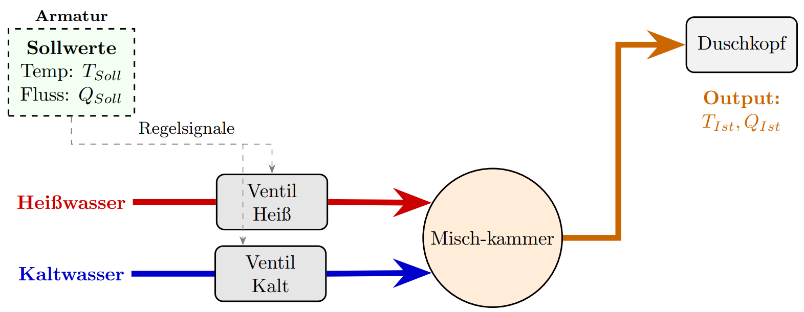
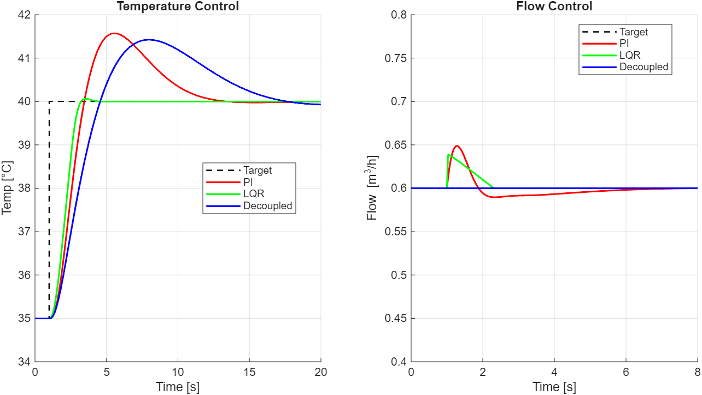
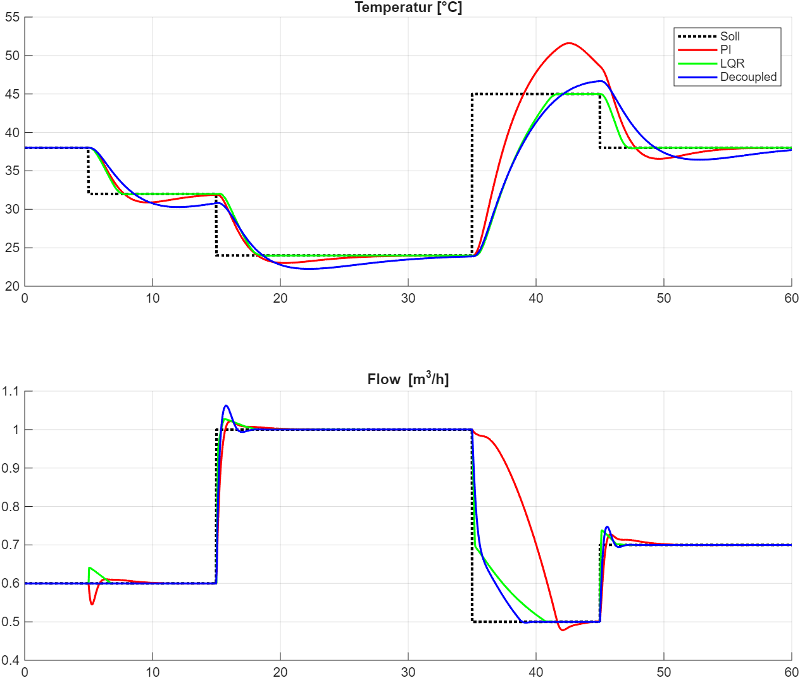

# Smart Shower Control (MIMO)

Simulation und Vergleich mehrerer Regler für eine Duscharmatur mit zwei Stellgrößen (Warm- und Kaltventil) und zwei Regelgrößen (Temperatur und Durchfluss).

## Ziel

Das Projekt untersucht, wie gut verschiedene Regler ein gekoppeltes MIMO-System führen, wenn sich Sollwerte ändern und Störungen auftreten (z. B. Druckabfall auf der Warmwasserseite).

## Abbildungen

### Gesamtsystem



### Reglervergleich Temperatur-Step



### Reglervergleich Sollwerte-Verlauf: "Gewitterdusche"


Das Bild zeigt das Regelverhalten von drei Reglern auf einen anspruchsvollen Sollwerte-Verlauf von Temperatur sowie Fluss. 

## Modell in Kurzform

- System: Mischkammer mit Ventildynamik und Sensorsignal
- Eingriffe: Ventilstellungen `u_h` und `u_c` (normiert auf `[0, 1]`)
- Ausgänge: Temperatur `T_sens` und Volumenstrom `Q_out`
- Modellbasis: nichtlineares Zustandsmodell mit RK4-Integration
- Arbeitspunktbezug: Linearisierung um den aktuellen Soll-Arbeitspunkt

## Physik des Modells

Das Modell koppelt Hydraulik und Thermik in einer Mischkammer:

- Volumenströme entstehen aus Ventilöffnung und Druckdifferenz (Wurzelgesetz):

$$
Q_h \sim u_h\,K_{v,h}\,\sqrt{P_h - P_{mix}},
\qquad
Q_c \sim u_c\,K_{v,c}\,\sqrt{P_c - P_{mix}}
$$

- Der Mischdruck `P_mix` ergibt sich aus den Zuläufen und der Düsencharakteristik.
- Der Gesamtdurchfluss ist:

$$
Q_{out} = Q_h + Q_c
$$

- Die Mischtemperatur folgt einer Energiebilanz im Volumen `V_mix`:

$$
\frac{dT_{mix}}{dt}
=
\frac{Q_h T_h + Q_c T_c - Q_{out} T_{mix}}{V_{mix}}
$$


- Ventile und Sensor werden als PT1-Glieder modelliert:

$$
\frac{du_{h,ist}}{dt} = \frac{u_{h,soll} - u_{h,ist}}{\tau_{valve}},
\qquad
\frac{du_{c,ist}}{dt} = \frac{u_{c,soll} - u_{c,ist}}{\tau_{valve}}
$$

$$
\frac{dT_{sens}}{dt} = \frac{T_{mix} - T_{sens}}{\tau_{sensor}}
$$

Damit bildet das Modell die wichtigsten Effekte ab: nichtlinearen Durchfluss, thermische Mischung, Aktorträgheit und Sensorverzögerung.

## Implementierte Regler

- `PI`: Zwei SISO-PI-Regler auf Diagonalpfaden
- `LQR`: Zustandsrückführung auf linearisiertem Modell
- `LQI`: LQR mit Integratorzuständen für stationäre Genauigkeit
- `Decoupled`: Statische Entkopplung + PI-Regler


## Schnellstart (MATLAB)

1. Projekt in MATLAB öffnen.
2. In den Ordner `shower_model` wechseln.
3. Eines der Vergleichsskripte ausführen:

```matlab
CompareControllers
```

Alternative Szenarien:

```matlab
CompareStep
CompareLQR_LQI
GewitterVerlauf
```

## Zentrale Dateien

- `shower_model/ShowerModel.m`: Nichtlineares Prozessmodell, Arbeitspunktberechnung, Linearisierung
- `shower_model/run_simulation.m`: Gemeinsame Simulationsschleife für alle Regler
- `shower_model/Controller_PI.m`: PI-Auslegung mit `pidtune`
- `shower_model/Controller_LQR.m`: LQR-Auslegung
- `shower_model/Controller_Decoupled.m`: Entkopplungsmatrix + PI-Auslegung
- `shower_model/Controller_LQI.m`: LQI-Auslegung mit augmentiertem Modell

## Voraussetzungen

- MATLAB (aktuelle Version empfohlen)
- Control System Toolbox (`ss`, `lqr`, `pidtune`, `dcgain`)
- Optimization Toolbox (`fsolve`)

## Hinweise

- Die Regler werden am jeweiligen Soll-Arbeitspunkt ausgelegt (vergleichbar mit Gain Scheduling).
- Stellgrößen werden auf `[0, 1]` begrenzt.
- In den Simulationsskripten sind Szenarien und Plotbereiche direkt einsehbar und leicht anpassbar.
